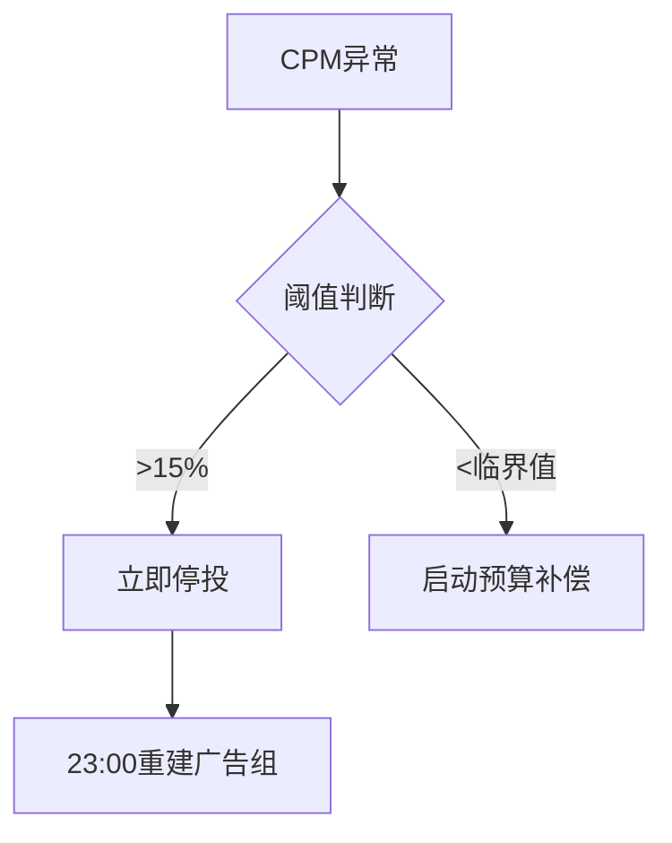

# Facebook广告精准投放与运营优化实战手册

---

## 多维账户管理体系
### 1.1 黄金账户三阶架构
**实验账户组（日预算$100-300）**
```python
优化路径 = {
    "测试周期": "72小时观察期",
    "晋级标准": "CTR≥1.8%且CPM<$12",
    "预警机制": "CPM突增15%即时熔断" [^1][^2]
}
```

**主力运营集群配置**
| 账户类型       | 核心功能                | 优化周期   |
|----------------|-----------------------|------------|
| 核心转化账户    | 验证受众精准投放        | 实时优化   |
| 潜在客户拓展池  | 相似受众挖掘           | 每周洗牌   |
| 沉睡用户唤醒库  | 智能再营销策略         | 动态调整   |

---

## 动态预算智能调控系统
### 2.1 四维决策模型


### 2.2 预算分配矩阵
| 优化场景       | 调控参数               | 执行策略                   |
|----------------|-----------------------|--------------------------|
| 新品上市期     | CPC<$0.8              | 阶梯式增量(+20%/24h)     |
| 成熟运营期     | ROAS≥2.5              | 智能均衡分配              |
| 促销冲刺期     | CVR≥3.5%              | 饱和式投放                |
| 衰退预警期     | CTR<0.5%              | 预算熔断机制              |

---

## 精准受众运营策略
### 3.1 五层用户分级模型
| 用户层级 | 行为特征               | 运营重点                  |
|----------|-----------------------|-------------------------|
| S级      | 7日内复购≥2次          | 专属VIP权益              |
| A级      | 加购未支付+深度咨询    | 限时折扣+免邮组合        |
| B级      | 内容互动≥3次           | 场景化内容培育           |
| C级      | 页面停留<30秒          | 痛点场景重构             |

### 3.2 兴趣词应用地图
```process
1. 种子词获取 → GPT生成30组核心词
2. 语义扩展 → 构建200+长尾词库
3. 竞争扫描 → 排除过热词项
4. 动态测试 → $5/组三日验证期
5. 矩阵组合 → 核心+场景+扩展词混投
```

---

## 高转化素材工坊
### 4.1 创意生产方程式
```
黄金素材公式 = (冲突场景×0.4) + (实证展示×0.3) + (限时激励×0.3)
爆款视频结构：
0-3s: 痛点场景冲击
4-9s: 产品解决方案
10-15s: KOL证言+数据背书
16-20s: 倒计时优惠机制
```

### 4.2 素材竞争力诊断
| 考核维度     | 优质阈值         | 处置方案               |
|--------------|-----------------|----------------------|
| 播放完成率   | ≥58%            | 跨渠道复用            |
| 互动成本     | ≤$0.25          | 扩大投放版位          |
| 分享率       | ≥3%             | 启动UGC共创计划       |

---

## 再营销技术矩阵
### 5.1 用户挽回策略组合
| 流失阶段     | 挽回方案                   | 执行时效   |
|--------------|---------------------------|-----------|
| 浏览未转化   | 动态商品重定向            | 24小时内   |
| 放弃支付     | 专属客服介入+免运费        | 2小时内    |
| 售后沉默     | 会员积分激活计划          | 7日触达    |

### 5.2 Pixel应用规范
```step
1. 全页面部署基础事件跟踪
2. 关键环节设置转化漏斗
3. 每周清洗数据确保精度
4. 异常波动自动诊断报警
```

---

## 长效运营监测体系
### 6.1 健康运营指标
| 监测维度       | 安全阈值         | 维护方案                     |
|----------------|-----------------|----------------------------|
| 素材更替率     | ≥25%/周         | AI创意生成器每日10组输出    |
| 受众新鲜度     | ≥40%/月         | 相似受众每周洗牌            |
| 频次控制       | ≤5次/周         | 高频用户自动排除            |

### 6.2 应急灾备方案
- **数据镜像**：每日04:00全账套备份
- **快速迁移**：
  1. 域名接管(<5分钟)
  2. 已验证受众自动同步
  3. 优质素材即时启用
  4. 支付通道智能切换

> **运营日历提醒**：每周一执行全域健康扫描，每月首周进行策略沙盘推演，重大节日提前14天配置专属预算池。
> [教学视频](https://youtube.com/shorts/IvYTwbK4hDw?feature=share)
